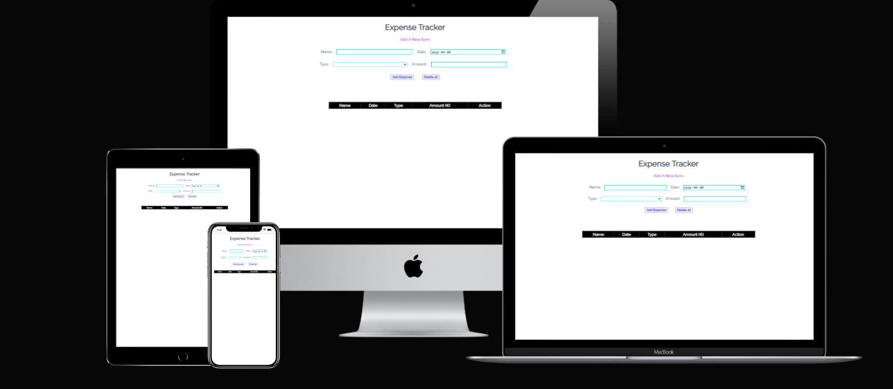
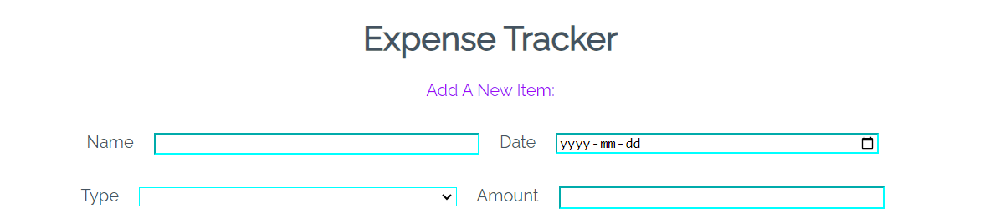
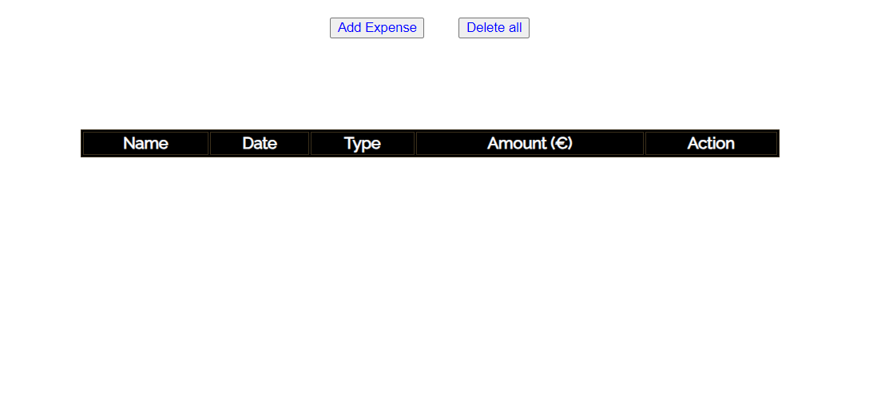
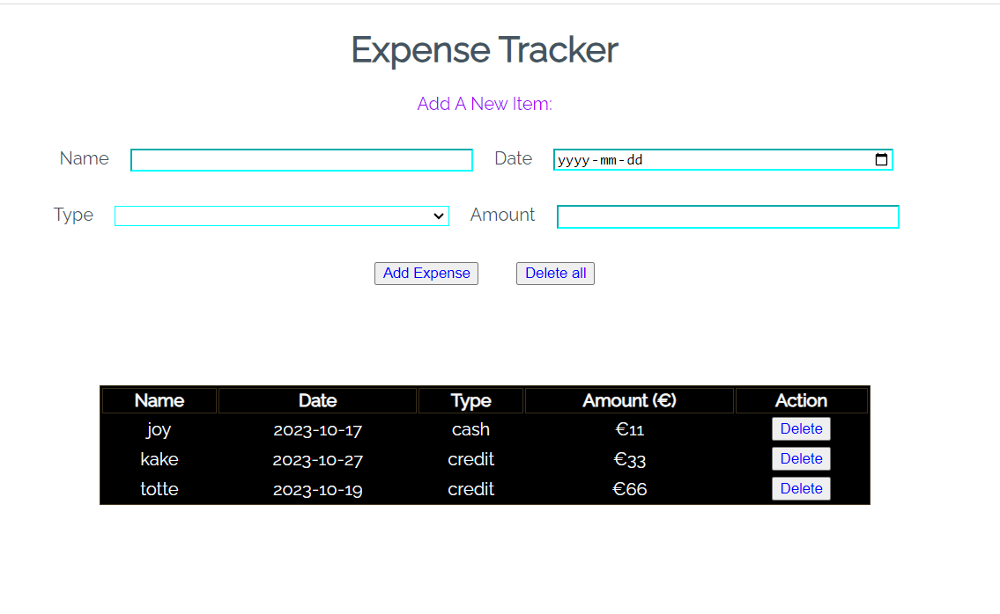
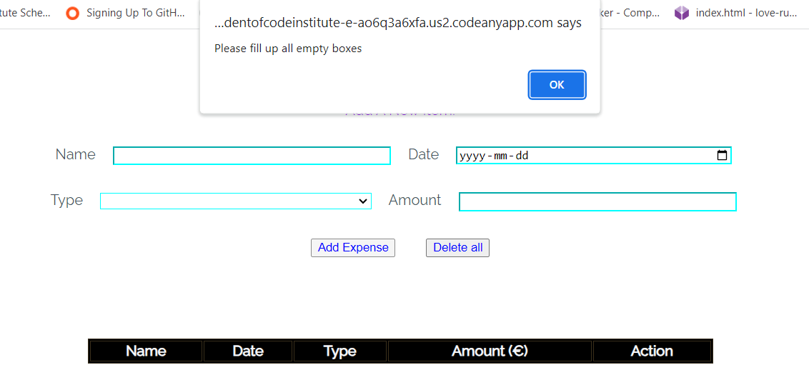
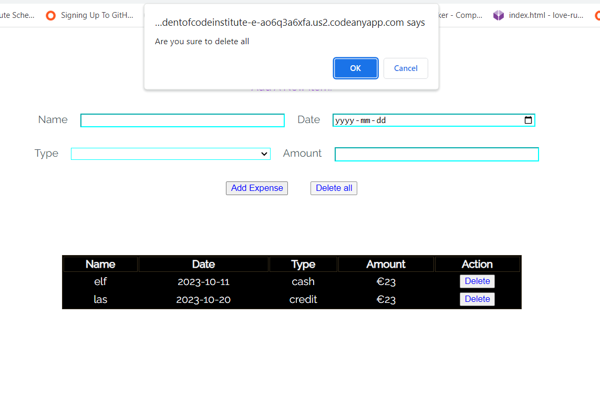
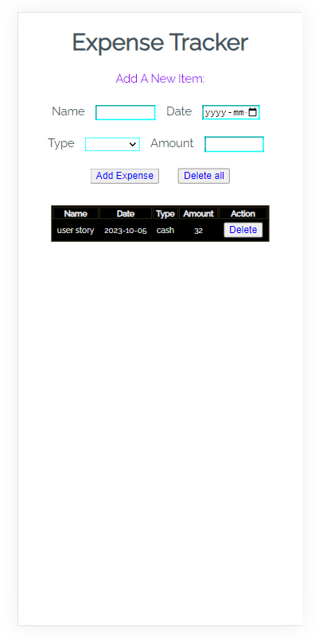
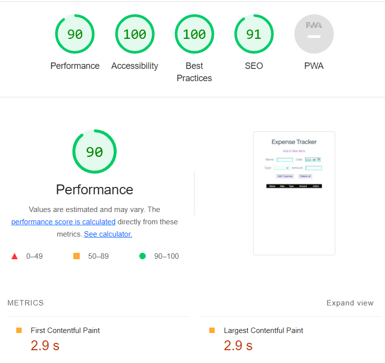

# Expense Tracker

The webpage restrain a page, constructed by HTML, CSS and JavaScript.

The website is made for people who live on a fixed income, and they find that towards the end of the month they don't have sufficient money to meet their needs. This software or application that helps to keep an accurate record of their money inflow and outflow. Designed to keep a track of Income-Expense of a person on a day-to-day basis.Expense tracker is useful in knowing the average of money spending each day. Incase of spending more then normal it will be easy to track it and use it wisely.

## Features

The website is made for store data. In this case, will store all expenses it will be added into table. It has been used LocalStorage to store data. There is a table to represent the data in order.
The software has main title named "Expense Tracker" and a message that invite to add expenses. There are four input boxes that has to be fill up, before the button "Add expense" is pressed, if not it will show the message "Please fill up all empty boxes". Delete all button is to delete all storage expenses row, it will show a message "Are you sure to delete all" before it. In the amount box is acceptable only number and currency is fixed to €.
At the bottom there is a table to represent all input data. Table has five header named: Name, Date, Type, Amount and action. Each input data will be replaced underneath each table header but action has a choiceble "Delete" button thats allow to delete single row.

### Existing Features

#### First section of  webpage

It's assembled by two parts;

1. Header, contain a title that satisfies own goal "expense tracker"
2. There are input options, specified for ectual user;
      1. Name.
      2. Date of expenses.
      3. Type. there are two options; Cash or Credit-card.
      4. Amount spended in Euro.

#### Second section of  webpage

It's assembled by three part;

1. Contain "Add Expense" button to add records of expenses in the table.
2. "Delete all" button to delete all rows.
3. The table, contain;
       1. Name.
       2. Date.
       3. Type.
       4. Amount.
       5. Delete button. It is for delete a row data, needs permission before action.

## Testing 

First test consists adding data value into boxes and press "Add expense". Has been tried three different time with different type of data value.

Second test consists pressing "Add expense" button without any values written on boxes; represent message bar "Please fill up all empty boxes" and give a chance to write again.

Third test consists to press "Delete all" and "Delete" button and there are two different message bar;

       1. "Are you sure to delete all" for the "Delete all" button.
       2. "Are you sure" to delete a single row.

Fourth test consists to open the software on mobile phone. the software has been checked as well as on mobole phones.

### Validator Testing

1. HTML:
   No errors were returned when passing through the official W3C validator.

2. CSS:
   No errors were found when passing through the official (Jigsaw) validator.

3. JSHint JavaScript Validator: No errors.

4. Accessibility

### Solved Bugs

Find out to delete a single row and replace another new row, after the existing row.

Find out the proper use of localstorage into javascript.

## Deployment

- The site was deployed to GitHub pages. The steps to deploy are as follows:
  - In the GitHub repository, navigate to the Settings tab
  - From the source section drop-down menu, select the Master Branch
  - Once the master branch has been selected, the page will be automatically refreshed with a detailed ribbon display to indicate  the successful deployment.

The live link can be found here -

## Credits

The main structure and design has been taken from youtube. Javascript main code idea has been taken from tutorial video. i divide them into two section content and media.

### Content

The main javascript coding structure idea has been taken from: <https://github.com/CodAffection/Pure-JavaScript-CRUD-Operations-with-Html/blob/master/script.js>

### Media

The main structure design Idea has taken from a video:

<https://youtu.be/RYE0QQKJI9o>
